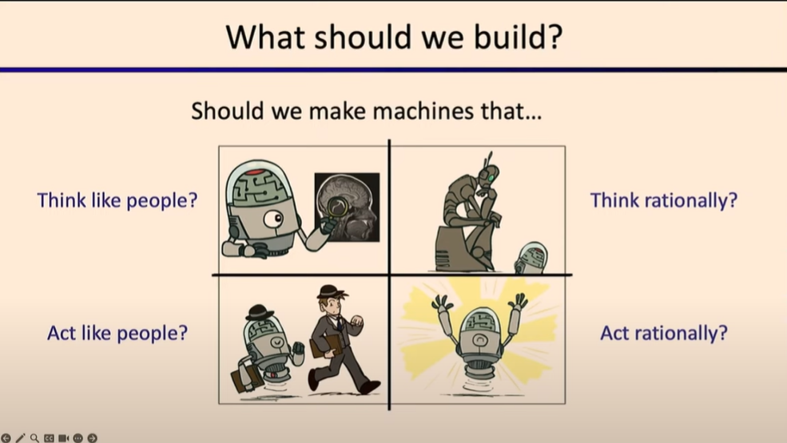

# Lec1: Intro to AI, Rational Agents
## What is AI
AI is having real-world impact.
What should we build?

## Rational Decisions
Rational: maximally achieving pre-defined **goals**.
**Goals** are expressed in terms of **utility** of the outcomes.
As world is uncertain, we use **expected utility** to evaluate actions.
Being **rational** means to maximize **expected utility**.

## Perspectives on Intelligence
- Skills based perspective: A system is only intelligent if it can do [X]. X can be any task.
However, there are so many tasks to be concluded, and people may argue whether a task is necessary to prove that a system is intelligent.
- Embodiment perspective: A system is only intelligent if it can **act** in the world.
- Psychometrics perspective: Measure abilities instead of skills across a broad range of tasks.
- Human-compatible perspective: 
1. Machine's objective is to maximize human utility.
2. Initially uncertain about human preferences.
3. Must learn human preferences from human behavior.

## About the Brain
Brains (human minds) are very good at making rational decisions, but not perfect.

## About this Course
Designing Rational Agents.
An **agent** is an entity that perceives and acts
Characteristics of the percepts, environment, and action space dictate techniques for selecting **rational** actions
