# Lec2: Search: State Spaces, Uninformed Search
## Agents that Plan
Reflex agents:
- Choose action based on current percept
- May have memory or a model    
- Do not consider the consequences of actions
- Consider how the world **is**

Planning agents:
- Ask "what if"
- Decision based on (hypothetical) consequences of actions
- Formulate a goal
- Consider how the world **would be**

## Search Problems
A `search problem` consists of:
- A state space
- A successor function(with actions and costs)
- A start state
- A goal test

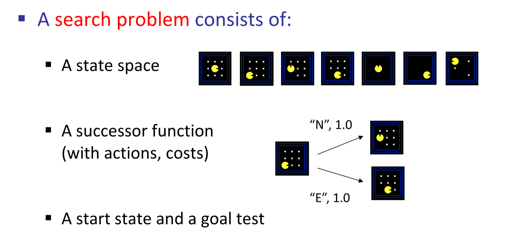

A `solution` is a sequence of actions (a plan) which transforms the start state to a goal state
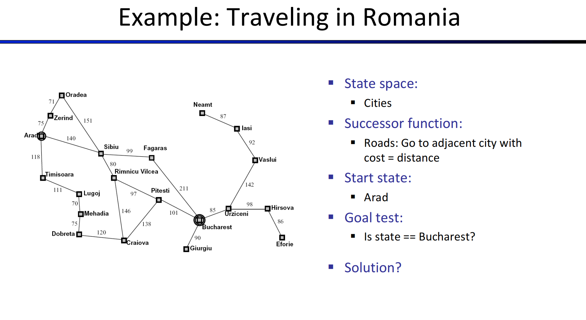

### What's in a State Space
The states of world is enormous, not even countable.
The `world state` includes every last detail of the current environment, while the `search state` includes everything just needed for planning(abstraction). 
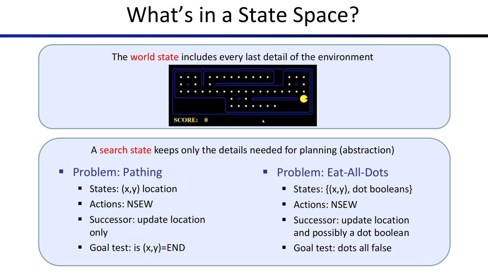
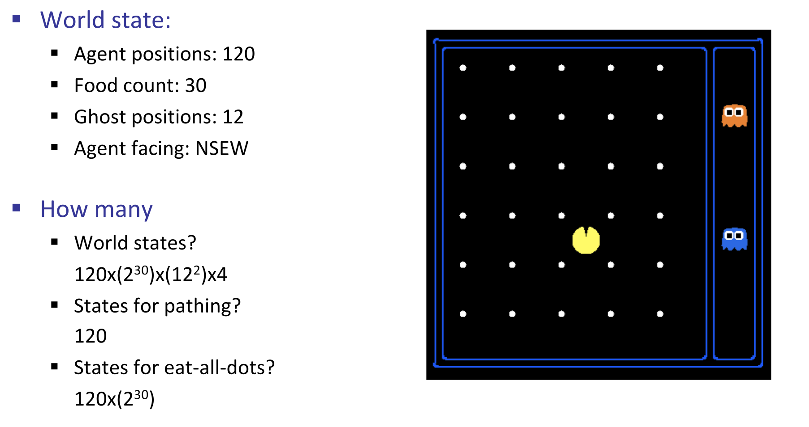

## State Space Graphs
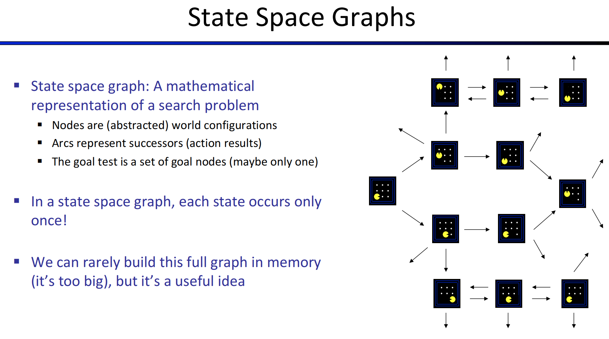

## Search Trees
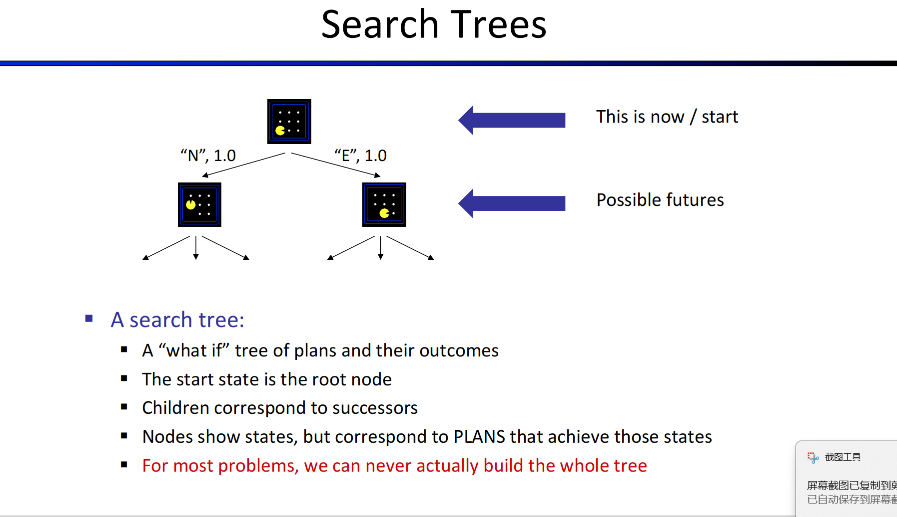
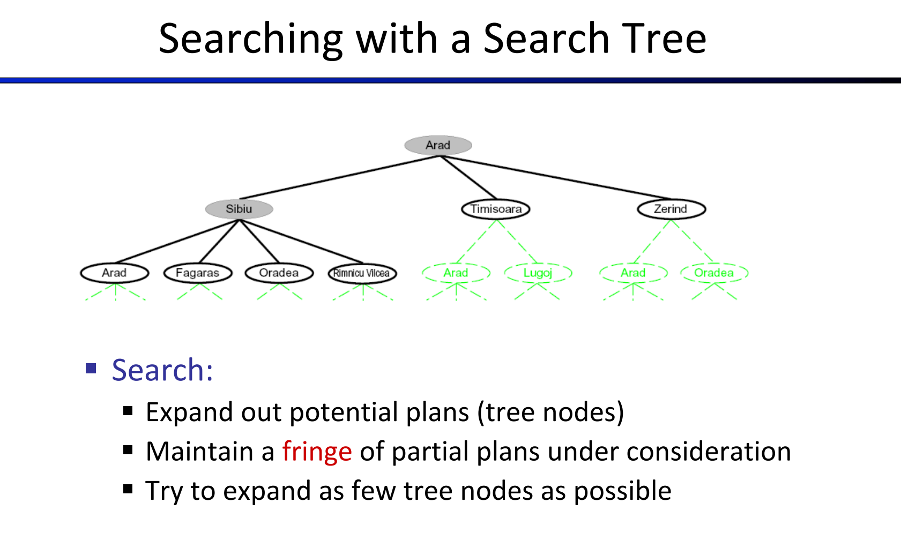
fringe: a data structure used to store all the possible states (nodes) that you can go from the current states.
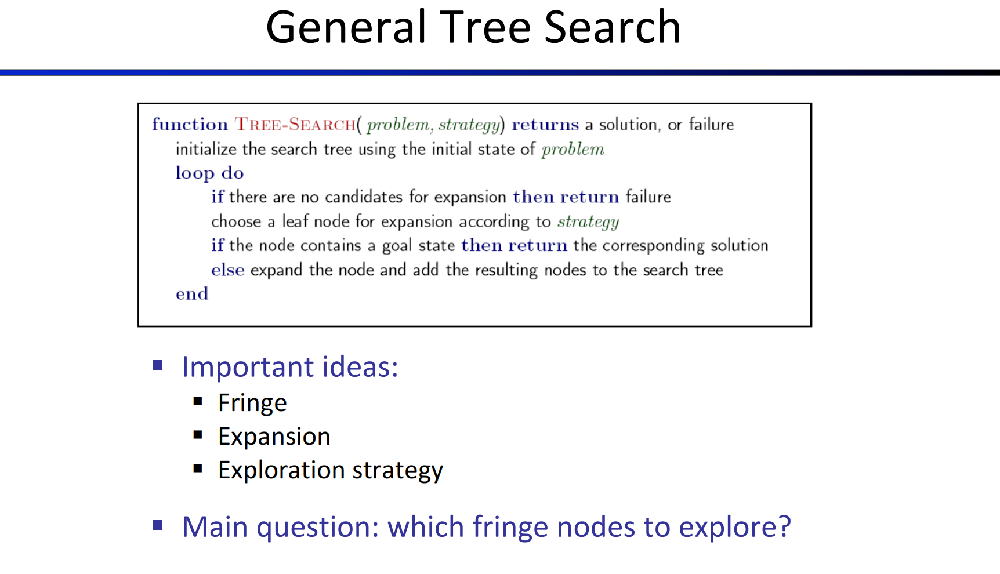
This algorithm expands nodes and try to generate one path from start state to goal state.
Node is made up with 4 parts:
- State: the current state
- Parent: the state that leads to the current state
- Action: the action that leads to the current state
- Path cost: the cost of the path from the start state to the current state, usually denoted as g(node)

We can use stacks to store frontiers.
- is_empty(frontier)
- pop(): remove the last element in the stack
- add(node): add a node to the stack
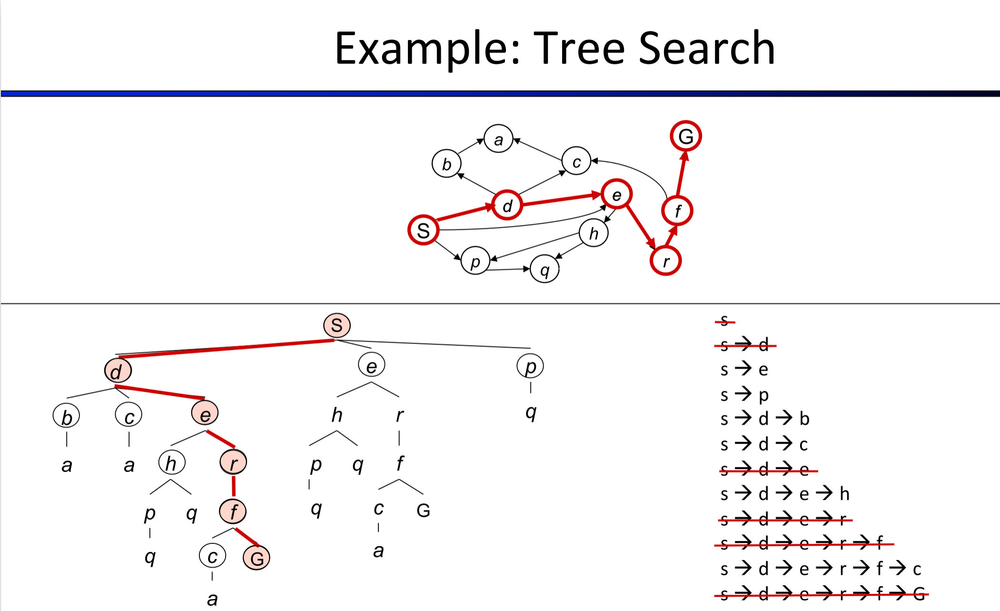

How we can know which path to add on fringe and expand?
## Depth-First Search
The fringe in DFS is a last-in first-off stack(LIFO)
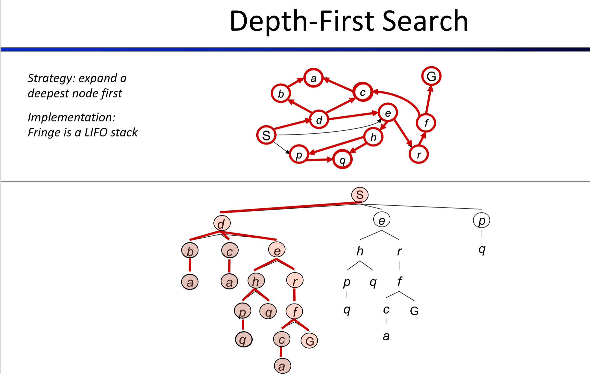
Take this as an example.
Assume that we go from right to left, so the first one added into fringe would be the root `S`.
Then we add `S->p`, `S->e` and `S->d` into the fringe.
Now that we didn't reach the goal state, we pop the very last one in the fringe, and replace with `S->d->e`, `S->d->c` and `S->d->b`.
Now `Sdb` is at top so we take it off and put its child on, getting `Sdba`.
Given that `a` is a leaf node, and we're not reaching goal state, we pop it out and the top of the fringe would actually be `Sdc`.
Then `Sdca` shares the same result, we look for `Sde`, and after multiple steps we finally get a path to G.

Depth-First: go down until we can't go anymore, then go backup and try another way and keep going until meet the goal.

## Search Algorithm Properties
- Complete: Whether it guarantees to find a solution if one exists?
When meet an infinite loop, might be unable to return a solution.
- Optimal: Whether it guarantees to find the least cost path?  --No.
- Time Complexity?
- Space Complexity?

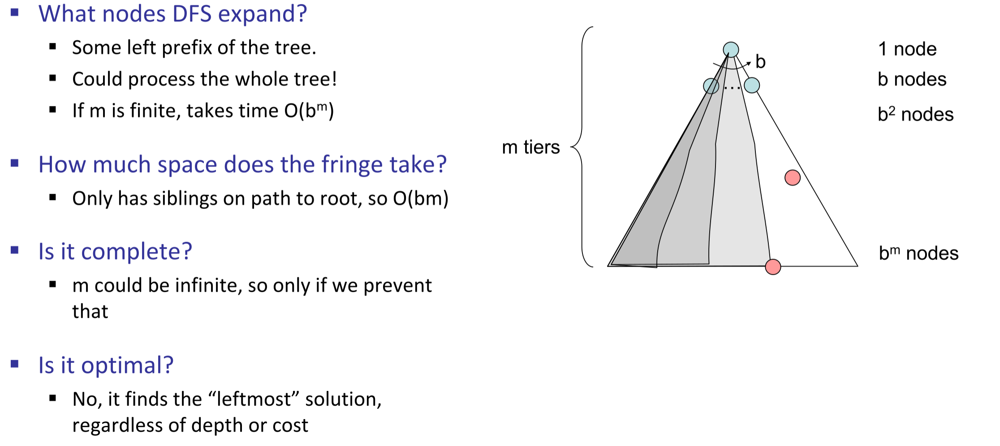
Might wonder why not start from right side, cuz in reality it is uninformed search so we don't know whether start from right would be faster.

## Breadth-First Search
