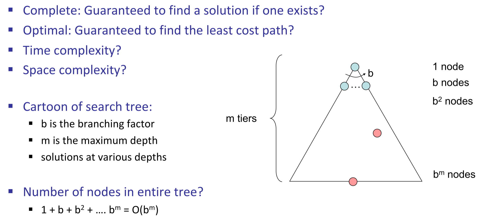

# Lec2: Search: State Spaces, Uninformed Search
## Agents that Plan
Reflex agents:
- Choose action based on current percept
- May have memory or a model    
- Do not consider the consequences of actions
- Consider how the world **is**

Planning agents:
- Ask "what if"
- Decision based on (hypothetical) consequences of actions
- Formulate a goal
- Consider how the world **would be**

## Search Problems
A `search problem` consists of:
- A state space
- A successor function(with actions and costs)
- A start state
- A goal test

A `solution` is a sequence of actions (a plan) which transforms the start state to a goal state

### What's in a State Space
The states of world is enormous, not even countable.
The `world state` includes every last detail of the current environment, while the `search state` includes everything just needed for planning(abstraction). 

## State Space Graphs

## Search Trees

fringe: a data structure used to store all the possible states (nodes) that you can go from the current states.

This algorithm expands nodes and try to generate one path from start state to goal state.
Node is made up with 4 parts:
- State: the current state
- Parent: the state that leads to the current state
- Action: the action that leads to the current state
- Path cost: the cost of the path from the start state to the current state, usually denoted as g(node)

We can use stacks to store frontiers.
- is_empty(frontier)
- pop(): remove the last element in the stack
- add(node): add a node to the stack

How we can know which path to add on fringe and expand?
## Depth-First Search
The fringe in DFS is a last-in first-off stack(LIFO)

Take this as an example.
Assume that we go from left to right, so the first one added into fringe would be the root `S`.
Then we add `S->p`, `S->e` and `S->d` into the fringe.
Now that we didn't reach the goal state, we pop the very last one in the fringe, and replace with `S->d->e`, `S->d->c` and `S->d->b`.
Now `Sdb` is at top so we take it off and put its child on, getting `Sdba`.
Given that `a` is a leaf node, and we're not reaching goal state, we pop it out and the top of the fringe would actually be `Sdc`.
Then `Sdca` shares the same result, we look for `Sde`, and after multiple steps we finally get a path to G.

Depth-First: go down until we can't go anymore, then go backup and try another way and keep going until meet the goal.

## Search Algorithm Properties
- Complete: Whether it guarantees to find a solution if one exists?
When meet an infinite loop, might be unable to return a solution.
- Optimal: Whether it guarantees to find the least cost path?  --No.
- Time Complexity?
- Space Complexity?

Might wonder why not start from right side, cuz in reality it is uninformed search so we don't know whether start from right would be faster.

## Breadth-First Search
The fringe in BFS is a first-in first-off queue(FIFO), the nodes waiting longest in the fringe will be expanded first.

Take this as an example, we wonna find `G`, suppose we start from left to right(uninformed, so any order is fine).
- First, we add `S` into the fringe.
- Then we expand `S`, and add `S->d`, `S->e` and `S->p` into the fringe.
- As `S->d` is the first to be added into the fringe, we expand it first, pop it out and add `S->d->b`, `S->d->c` and `S->d->e` into the fringe.
- Now in the fringe, `S->e` is the one waiting longest, so we expand it next. Popping it out, we add `S->e->h` and `S->e->r`
- In the same way we pop out `S->p` and add `S->p->q` into the fringe.
- We follow this pattern until we find `G`.

From the graph we can easily understand that the nodes are expanded tier by tier. If this tier is not over, it won't search next tier.

So BFS searches from top to bottom, and finds the shortest path to the goal(shallowest solution).

Let the depth of the shallowest solution be d, then the time complexity of BFS is O(b^d), where b is the branching factor.
And the space complexity is O(b^d), illustrating how many paths we track in the fringe.

## DFS vs BFS
The only time when we need DFS other than BFS is when using BFS would cause a computer crash, like when more memory is required.

## Iterative Deepening Search
Get DFS's space advantage and BFS's time and shallow-solution advantage.
Process:
- Start with a **shallowest limit**, say 0.
- Do DFS with this limit, if not found, increase the limit by 1 and do DFS again.
- Keep doing this until we find the goal state.

Might think this repetition is redundant, as we search top levels with a lot more times, but as most work is done at bottom levels, so it is affordable.

Example:
When branching factor is 10, and solution depth is 5:
- BFS: 10 + 100 + 1000 + 10000 + 100000 = 111110
- IDS: $10\times5$ + $100\times4$ + $1000\times3$ + $10000\times2$ + $100000\times1$ = 123450
We need these number of nodes to expand to find the solution, so the difference won't be so big.

IDS would be a little bit slower but saves lots of memory. Space complexity is O(bd), where b is the branching factor and d is the depth of the shallowest solution.

## Cost-Sensitive Search
BFS finds the shortest path, but it doesn't consider the cost of the path.

### Uniform-Cost Search
Expand a cheapest node first, and its fringe is a priority queue.
We remove the path that has the lowest cost so far in the queue and expand it.

Take this as an example.
- Firstly we add `S` into the fringe, then `S->d`, `S->e` and `S->p`.
- Then we expand `S->p`, for it has cheapest cost 1, so we pop it out and add `S->p->q` into the fringe, and its cost is 1+15=16 now.
- Then the lowest would be `S->d`, for it has cost 3, so we pop it out and add `S->d->b`, `S->d->c` and `S->d->e`into the fringe, and their cost is 4, 11 and 5 respectively.
- In the same way we expand `S->d->b->a`
- Finally we reach goal state, with cost 10.

It is worth mentioning that the goal state is added to fringe but we don't return it immediately.
Goal states are returned only when we're about to expand it, cuz it is exactly when the path has lowest cost.
For example in this case above, when we expand `S->d->e->r->f`, assume it is lowest now with cost 8, so we expand it and `S->d->e->r->f->G` is already in the fringe, if we return it right now it might be false.
`S->d->e->r->f->G` has cost 10, assume we can reach G by `S->e->G` and cost `e->G` is 0, `S->e->G` is cost 9 and it is actually cheaper!
So we can't return immediately when the goal state is in fringe, but should be when the path containing goal state is about to be expanded.
Like right now, `S->e->G` is cheaper than `S->d->e->r->f->G`, so we return `S->e->G` instead of `S->d->e->r->f->G`.

**Only when we are about to expand the goal state, we stop and return the path.**

If solution path costs $C^*$, and each action cost at least $\epsilon$ its "depth" would be $C^*/\epsilon$ then time complexity of UCS is $O(b^{C^*/\epsilon})$.
And space complexity is roughly $O(b^{C^*/\epsilon})$.

## The One Queue
All searching strategies are same except for the fringe strategies.
