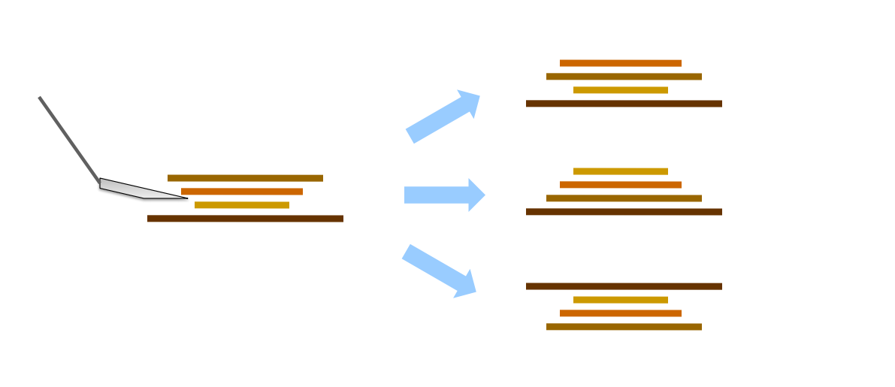
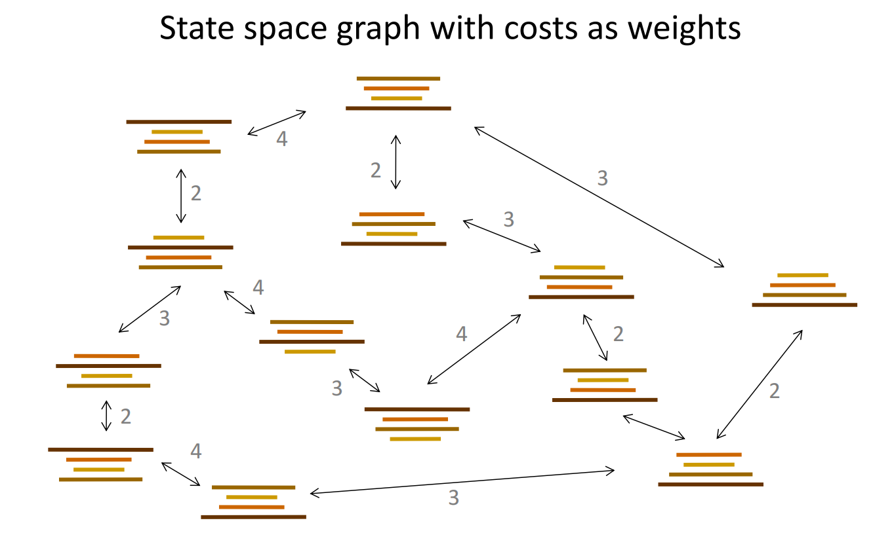
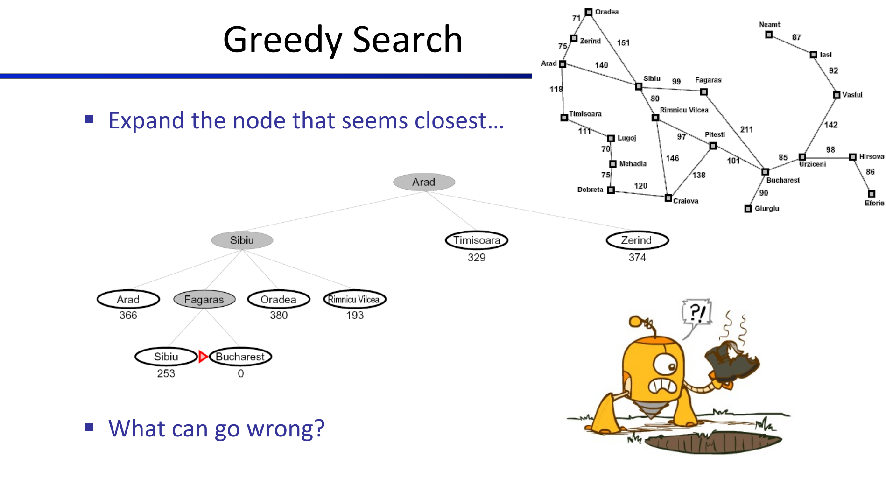
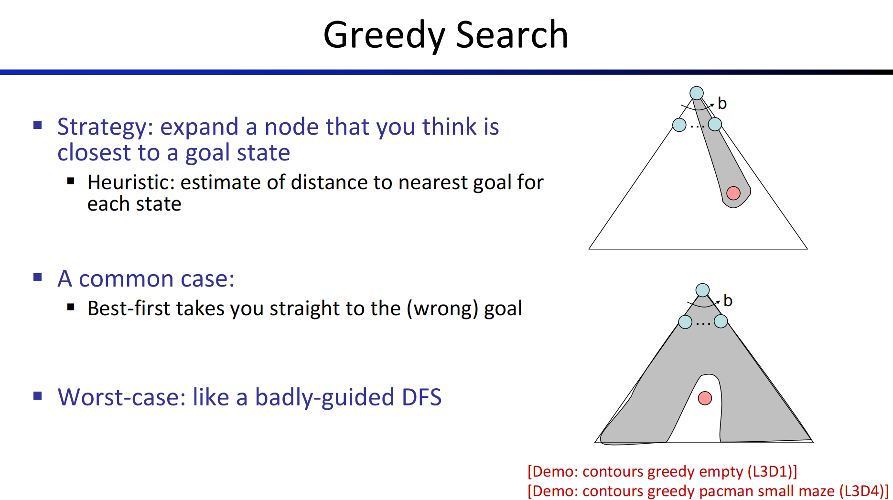
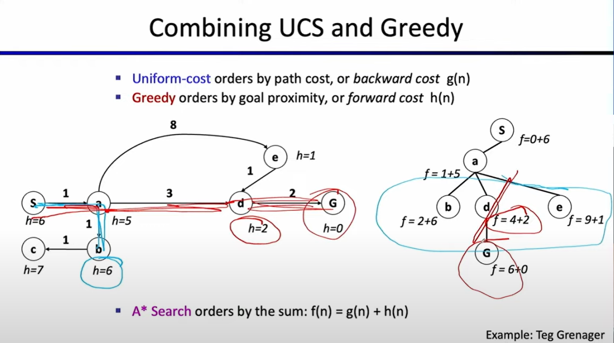
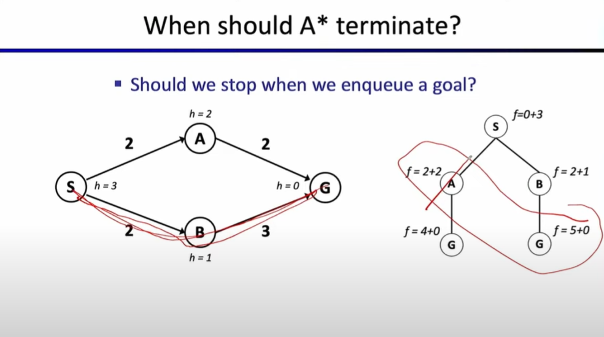

# Lec3: Informed Search
## Example: Pankake Problem

Now we have a few pankakes, and we want the bigger one at bottom, and smaller one at top.
We have a spacula that can flip the pancakes.
We can make a model, and states are the configurations of the pancakes.
Actions are the flips.
Search one path from initial state to goal state.

In this case we know that search problems can be used beside 2D path finding puzzles, as long as we can modelize real life problems into search problems(planning problem).

## Informed Search
UCS explores everywhere. What if we know sth about our goal state, and we can prune some of the branches in our search tree?

### Search Heuristics
A heuristic is a function that **estimates** how close a state is to the goal state, returning a real number.
Example: Euclidean distance and Manhattan distance
It's just an estimate cuz we got walls in a Pacman world.

### Greedy Search
Expand the node that **looks** closest to the goal state(having small heuristic value).

When heuristic value becomes 0, illustrating we found the goal state.

What can go wrong?
There might be a cheaper path to the goal state that we didn't explore, and heuristic is just an estimate while we rely on it too much.

### A* Search
We can view greedy search as a **hare**, as it goes directly for the target, while UCS as a **tortoise** because it takes a lot of time but will definitely find an optimal goal state.
Is there a way to combine these two?

Uniform-cost orders by **path cost**, or **backward cost** $g(n)$
Greeedy orders by **heuristic value**(goal proximity), or **forward cost** $h(n)$

Putting them together, A* search orders by $f(n) = g(n) + h(n)$

We expand the node with smallest $f(n)$.
Is it when we see the goal state we return?

In this case, we expand b because it has smallest $f(n) = 1 + 2 = 3$, and we see the goal state `G`, but if we return the path immediately, we're wrong cuz the other route has smaller cost.

So only when the goal state is about to be expanded, we return the entire path.
