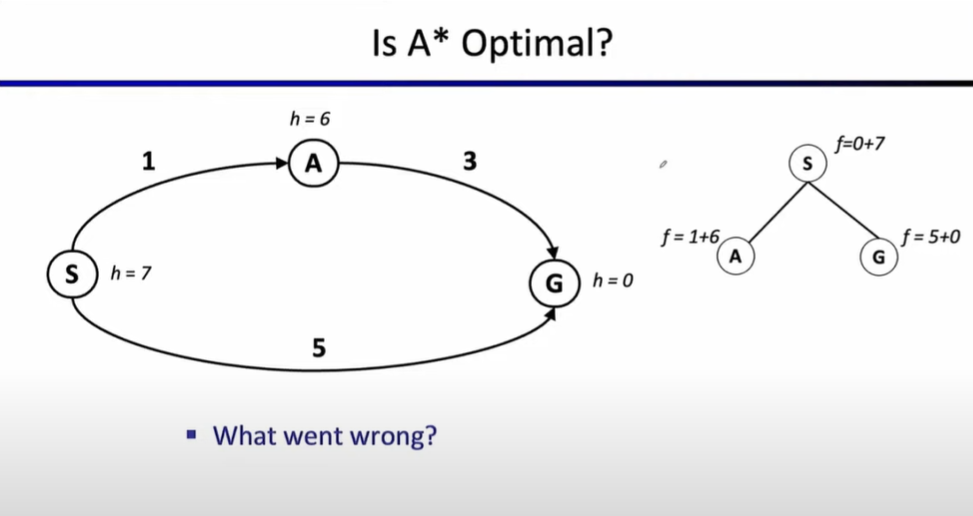
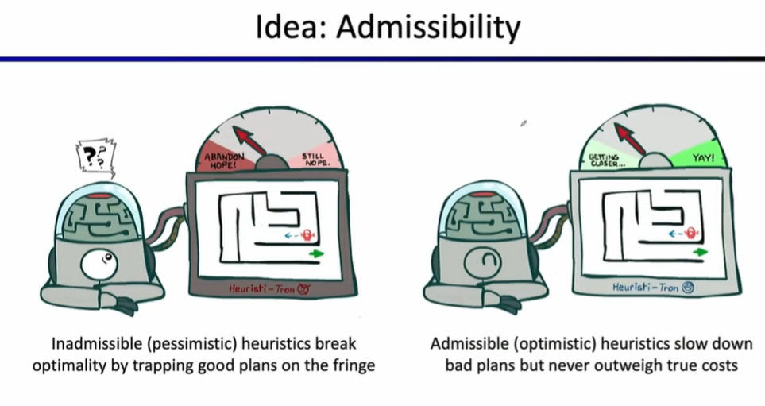
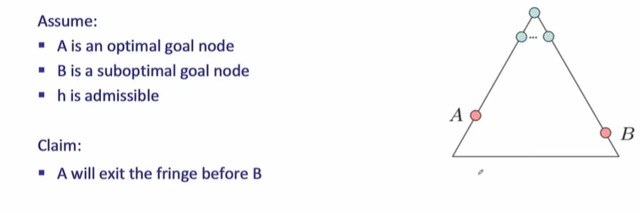
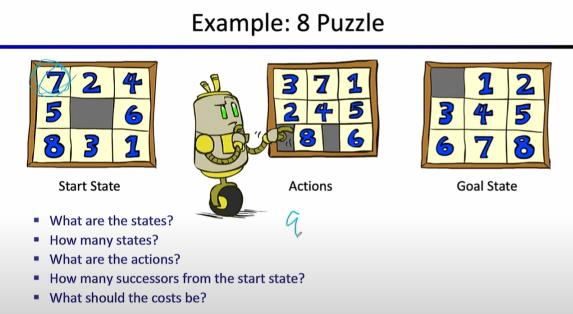
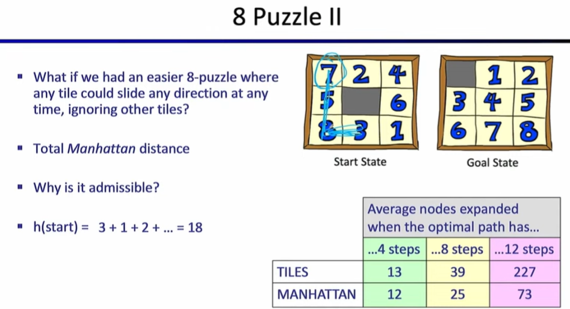

# Lec3: Informed Search
## Example: Pankake Problem

Now we have a few pankakes, and we want the bigger one at bottom, and smaller one at top.
We have a spacula that can flip the pancakes.
We can make a model, and states are the configurations of the pancakes.
Actions are the flips.
Search one path from initial state to goal state.

In this case we know that search problems can be used beside 2D path finding puzzles, as long as we can modelize real life problems into search problems(planning problem).

## Informed Search
UCS explores everywhere. What if we know sth about our goal state, and we can prune some of the branches in our search tree?

### Search Heuristics
A heuristic is a function that **estimates** how close a state is to the goal state, returning a real number.
Example: Euclidean distance and Manhattan distance
It's just an estimate cuz we got walls in a Pacman world.

### Greedy Search
Expand the node that **looks** closest to the goal state(having small heuristic value).

When heuristic value becomes 0, illustrating we found the goal state.

What can go wrong?
There might be a cheaper path to the goal state that we didn't explore, and heuristic is just an estimate while we rely on it too much.

### A* Search
We can view greedy search as a **hare**, as it goes directly for the target, while UCS as a **tortoise** because it takes a lot of time but will definitely find an optimal goal state.
Is there a way to combine these two?

Uniform-cost orders by **path cost**, or **backward cost** $g(n)$
Greeedy orders by **heuristic value**(goal proximity), or **forward cost** $h(n)$

Putting them together, A* search orders by $f(n) = g(n) + h(n)$

We expand the node with smallest $f(n)$.
Is it when we see the goal state we return?

In this case, we expand b because it has smallest $f(n) = 1 + 2 = 3$, and we see the goal state `G`, but if we return the path immediately, we're wrong cuz the other route has smaller cost.

So only when the goal state is about to be expanded, we return the entire path.

UCS and Greedy are special cases of A* search.

Is A* search always optimal?

Could go wrong cuz heuristic is just an estimate, and it could go wrong.
So we need heuristics to be less than or equal to the actual cost to the goal state.

#### Admissible Heuristic

A heuristic h is admissible if it never overestimates the cost to reach the goal state.
$$
0\leq h(n) \leq h^*(n)
$$

$h^*(n)$ is the actual cost to reach a nearest state.
Admissible heuristics only underestimate the distance to reach the goal state.

#### Optimality of A* Search

A is shorter path than B.
A is an optimal node and B is a suboptimal node.

### Creating Heuristics
Often, admissible heuristics are solutions to **relaxed problems**.
Like in the example of traveling from Arad to Bucharest, we can relax the problem by not considering the traffic, and we can fly!
Another example is like pacman can cross through walls.

Heuristic: number of tiles out of place.
It solves a relaxed problem where we can move any tile to any position.

Another heuristic is Manhattan distance for every tile.

What if we use the actual cost as a heuristic?
The problem is that it might be difficult to find the actual cost, meaning we have to actually solve the planning problem.

If heuristic h1 is always bigger than h2 for every node, then we say h1 is more accurate, and max(h1,h2) is still admissible.
Using h1 would cost us even less time to find the optimal solution.