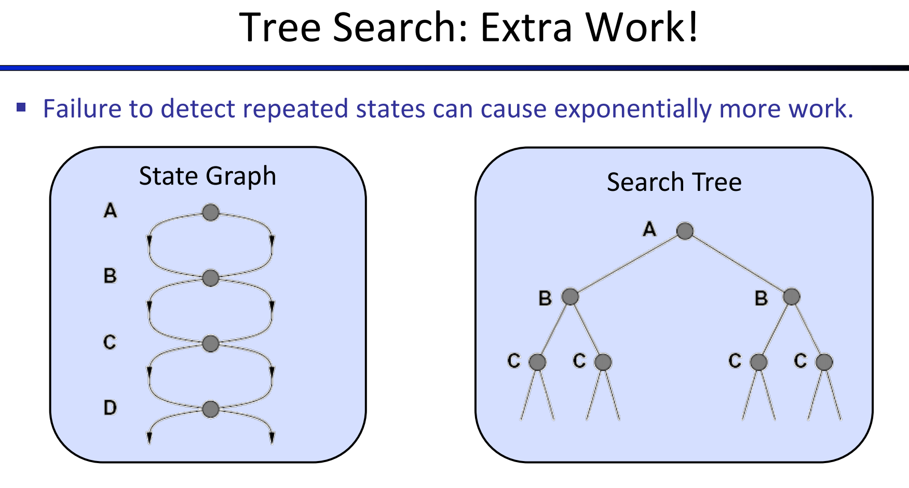
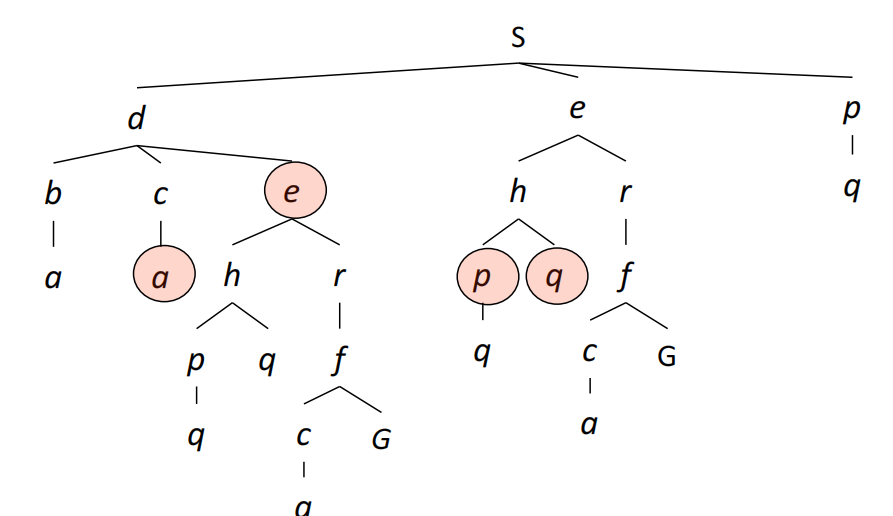
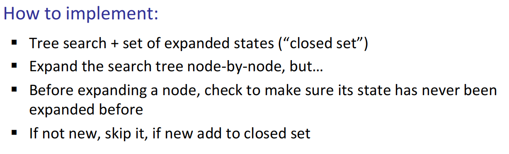
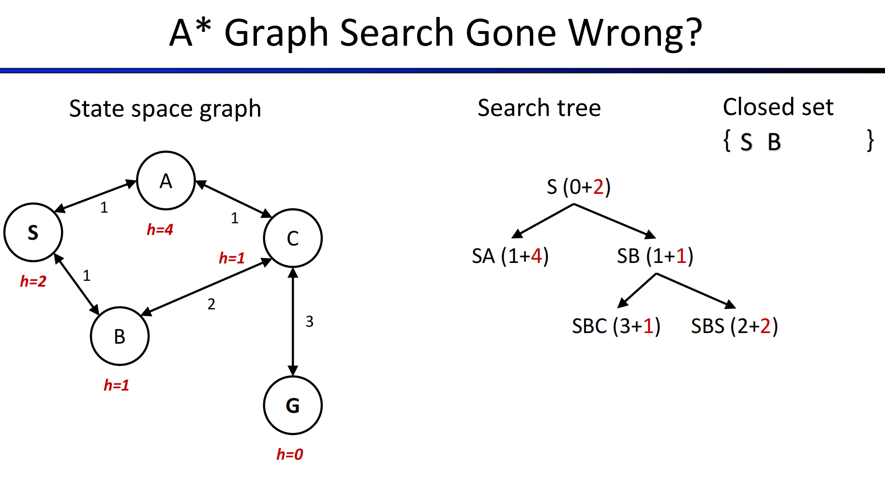
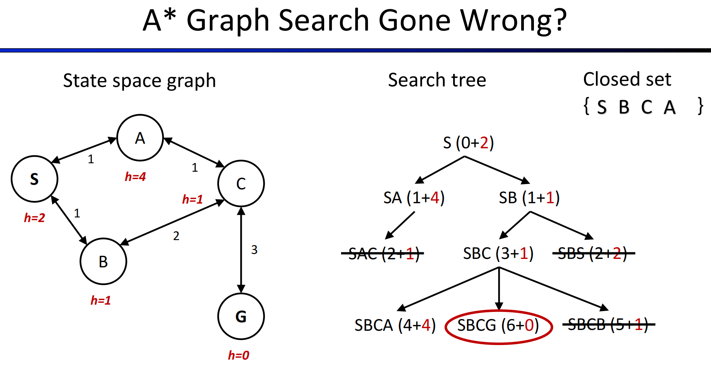

# Lec4: Local Search
## Graph Search
Tree search can generate the same node multiple times and that is a waste of time.

And so the idea of graph search is to **never expand a state twice**.

In this tree we can see 2 identical subtrees with root `e`, and store 2 of them is wasting space.

Store the closed set as a set instead of a list, to avoid repeated elements.

Is this still optimal?

If the node next to expand is in the closed set, then we should not expand it, just pop the path in the fringe.

But in this case, SBCG is not the optimal path! Why is this? Why A* Graph Search failed?
That's because we need consistent heuristic function.

### Consistency of Heuristics

