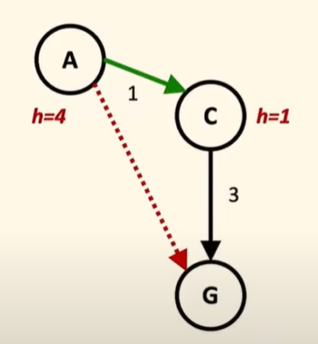

# Lec4: Local Search
## Graph Search
Tree search can generate the same node multiple times and that is a waste of time.

And so the idea of graph search is to **never expand a state twice**.

In this tree we can see 2 identical subtrees with root `e`, and store 2 of them is wasting space.

Store the closed set as a set instead of a list, to avoid repeated elements.

Is this still optimal?

If the node next to expand is in the closed set, then we should not expand it, just pop the path in the fringe.

But in this case, SBCG is not the optimal path! Why is this? Why A* Graph Search failed?
That's because we need consistent heuristic function.

### Consistency of Heuristics
The idea of an admissible heuristic is that it always **underestimate** the true cost to reach the goal.
Consistency: heuristic "*arc*" cost $\leq$ actual cost for each arc

This is different from admissibility, which focuses on estimating the cost to reach the goal.
This estimates the node to another node, aka the cost of the arc.
In this way the heuristic could underestimate the cost of an **action**.

In this example, say that we're going from `A` to `C`, and this action's true cost is 1, while the heuristic estimate is 3, so it is not consisitent.
If $h(A)-h(C)\leq cost(A \text{ to } C)$ for all A and C, we say it is consistent.
This can also be interpreted as the **triangle inequality**:
$$
h(A)\leq cost(A \text{ to } C)+h(C)
$$
So the 3 edges must satisfy the triangle inequality, to make the heuristic a consistent one.

If we change $h(A)$ to 2 in the case, it would be consistent.

If we have consistent heuristics for all nodes, then the f value never decreases along one specific path and the A* Graph Search would be optimal.

### Optimality of A* Graph Search
Fact 1: A* expands nodes in increasing f value for sure, because heuristic is always smaller than actual cost.
