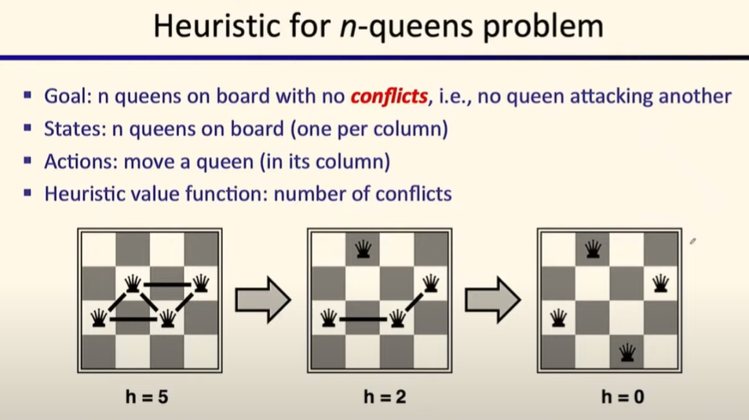
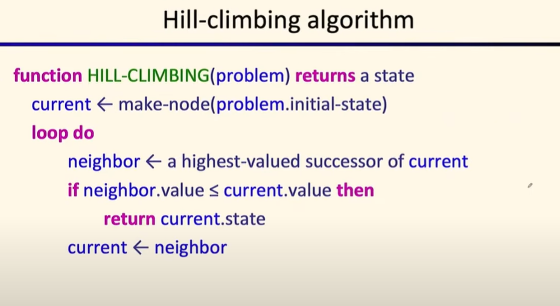
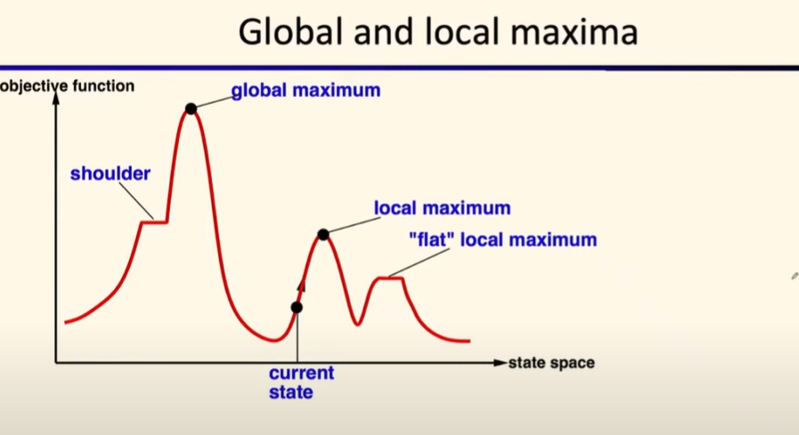
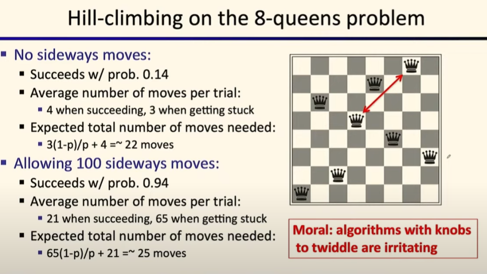

# Lec4: Local Search
## Graph Search
Tree search can generate the same node multiple times and that is a waste of time.

And so the idea of graph search is to **never expand a state twice**.

In this tree we can see 2 identical subtrees with root `e`, and store 2 of them is wasting space.

Store the closed set as a set instead of a list, to avoid repeated elements.

Is this still optimal?

If the node next to expand is in the closed set, then we should not expand it, just pop the path in the fringe.

But in this case, SBCG is not the optimal path! Why is this? Why A* Graph Search failed?
That's because we need consistent heuristic function, or the order of expansion may lead to suboptimal paths because it might include one node in the closed set while it is the optimal path.

### Consistency of Heuristics
The idea of an admissible heuristic is that it always **underestimate** the true cost to reach the goal.
Consistency: heuristic "*arc*" cost $\leq$ actual cost for each arc

This is different from admissibility, which focuses on estimating the cost to reach the goal.
This estimates the node to any another node, aka the cost of the arc.
In this way the heuristic could underestimate the cost of an **action**.
The arc might include **multiple actions**, it estimates the cost to get to any other node.

In this example, say that we're going from `A` to `C`, and this action's true cost is 1, while the heuristic estimate is 3, so it is not consisitent.
If $h(A)-h(C)\leq cost(A \text{ to } C)$ for all A and C, we say it is consistent.
This can also be interpreted as the **triangle inequality**:
$$
h(A)\leq cost(A \text{ to } C)+h(C)
$$
So the 3 edges must satisfy the triangle inequality, to make the heuristic a consistent one.

If we change $h(A)$ to 2 in the case, it would be consistent.

If we have consistent heuristics for all nodes, then the f value never decreases along one specific path and the A* Graph Search would be optimal.

### Optimality of A* Graph Search
Fact 1: A* expands nodes in increasing f value for sure, because heuristic is always smaller than actual cost, until it reaches the goal with the least f value.
Fact 2: For every state, nodes leading to optimality would be expanded before any non-optimal nodes.
Fact 3: As for the goal state, its heuristic is always 0, so having least f value means it has least cost (G value) to reach the goal.

So A* Graph Search is optimal if the heuristic is **consistent**.
And recap that A* Search is optimal if the heuristic is **admissible**.

Being consistent implies admissibility, cuz admissible heuristic just need to underestimate the arc to get to the goal, while consistent heuristic need to underestimate all arc from this node to any other node.

### Improvement of A* Graph Search
A* keeps track of the entire explored region, even A* graph search, so it might be a huge memory cost.
To make it better, we can use **iterative deepening A* (IDA*)**, which is a variant of A* that limits the depth of the search to a certain value.
Just like the Iterative Deepening Search of DFS, IDA* change the depth limit into an f value limit.
On each iteration, it remembers the smallest f value above the limit and use it as the new limit for the next iteration.

This is very efficient when f is real and each node has a unique value.

## Search and Models
Modeling is the first step, turning the real world problem into a model that can be solved by search algorithms.
If we have a bad model, no matter how optimal the search algorithm is, it would not work.

Always remember: models are not real world.

## Local Search (Hill Climbing)
In many optimization problems, the **path** is not important, the **goal state** is the solution.
The state spaces are still defined as a set of complete configurations, but the goal state can just be a configuration that satisfy some constraints, or looking for one optimal configuration.

In these cases, we can use **iterative improvement** algorithms: keep track of the **current** state, and try to improve it by moving to a better state.
It uses constant space cuz we only focus on one state.

General idea of hill climbing:
- Start wherever
- Repeat: move into the best neighboring state
- Quit when no better neighbor state

### Example: n-Queens Problem
Queen will attack each other if they are in the same row, column, or diagonal.
Our goal is to place n queens on an n×n chessboard such that no two queens threaten each other.

We use this as heuristic function, and generate an hill-climbing algorithm.

While we might meet challenges in local search, if we're getting a local maximum instead of a global one, we would still return this while this might not be the optimal solution.

One easy fix is we start randomly, at many initial states and we may get the global maximum, and random sideways.

Use this hill climbing algorithm to solve the n-Queens problem.

## Simulated Annealing

