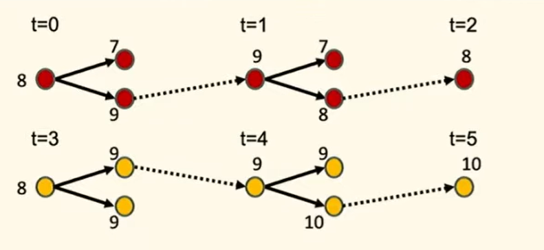
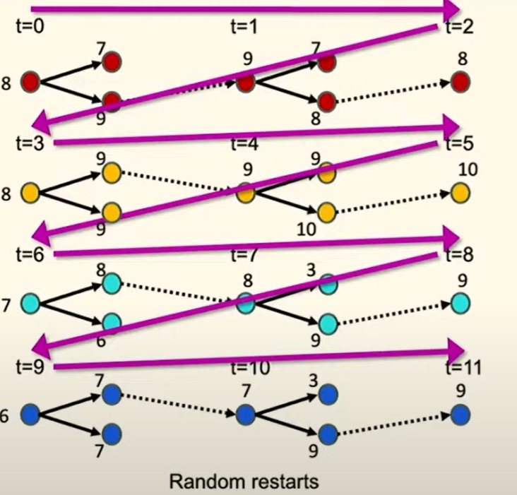
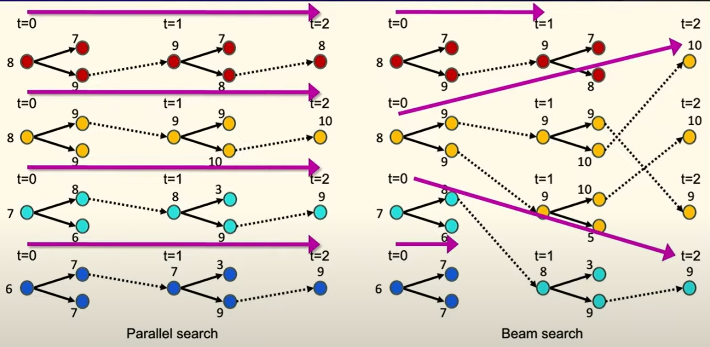
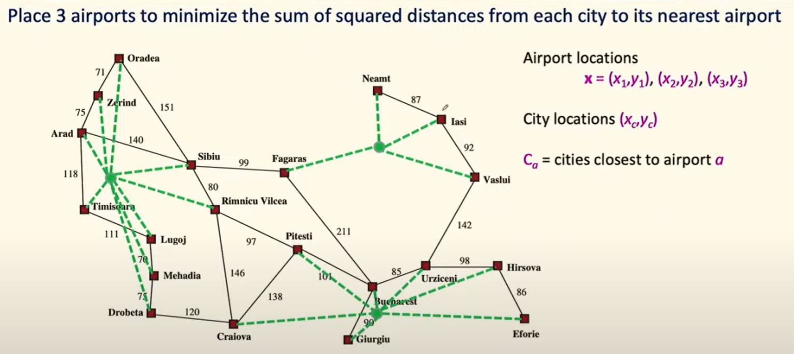

# Lec5: Trees, Minimax, Pruning
## Recap: Random restarts, parallel search and beam search

At first we start at 8, and get a local maximum 9.
We might think it's not so great, so we do another random restart, in yellow color, and getting a local maximum 10.

So by doing lots of random restarts, we have a large probability to get a global maximum, and this is parallel search.

While in beam search, the random starts communicate with each other, and get the best one.

Like in this case, the dark blue random start is disposed, as we only need top k best ones.

## Local Search in Continuous Space

Say that we're going to place 3 airports in Romania to minimize the total distance between the cities and the nearest airports.

