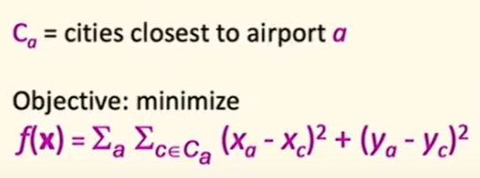
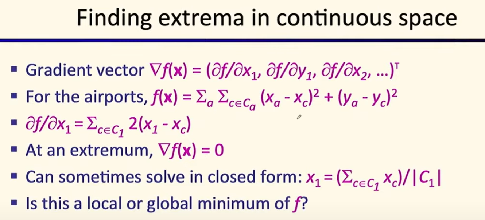
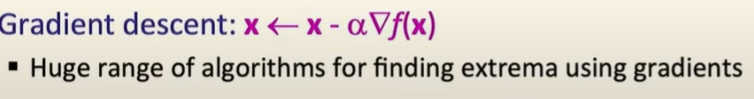
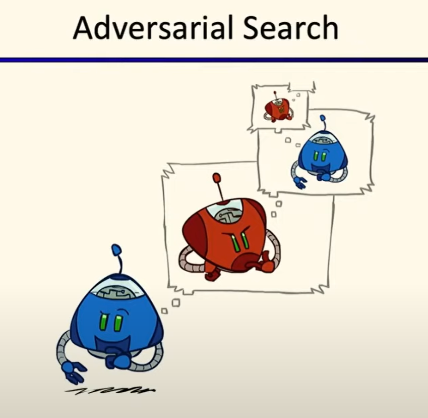
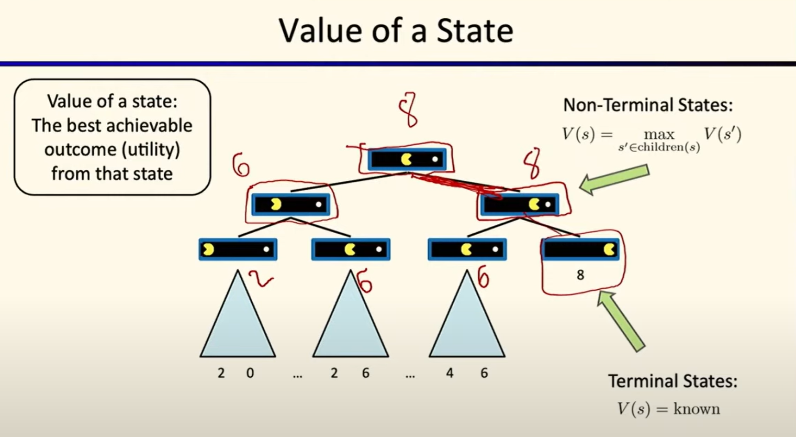
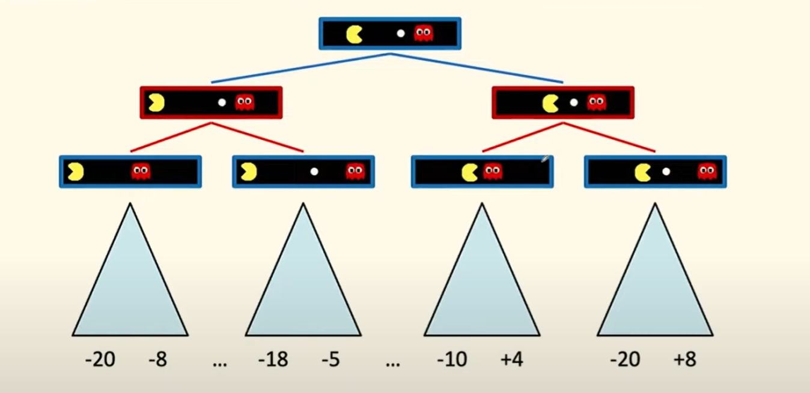
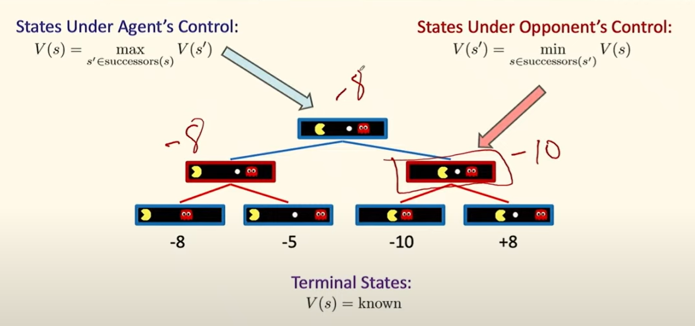
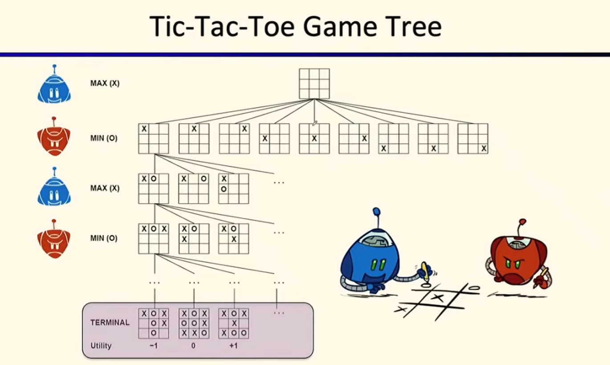

# Lec5: Trees, Minimax, Pruning
## Recap: Random restarts, parallel search and beam search

At first we start at 8, and get a local maximum 9.
We might think it's not so great, so we do another random restart, in yellow color, and getting a local maximum 10.

So by doing lots of random restarts, we have a large probability to get a global maximum, and this is parallel search.

While in beam search, the random starts communicate with each other, and get the best one.

Like in this case, the dark blue random start is disposed, as we only need top k best ones.

## Local Search in Continuous Space

Say that we're going to place 3 airports in Romania to minimize the total distance between the cities and the nearest airports.

The x in bold represents the current state, and we keep track of the position of cities and their distances to the nearest airports.

How to handle a continuous state space?
1. Discretize it. 
- Define a grid with increment $\delta$, like rounding a number into one integer or thinner coarseness one.
- While the size of the grid being small, it might not be optimal enough, but being too big requires lots of computation.

2. Choose random perturbations to the state.
a. First-choice hill climbing: keep trying until state improved
b. Simulated annealing: accept a worse state with some probability

3. Compute the gradient of the function $f(x)$ analytically, set it to 0 and try to solve it for a flattened hill.

By calculating gradient we can get positions of the 3 airports, as long as we know the cities closest to them respectively.
The cities closest to airport 1 ($C_1$) for example, can be changed in different cases, and by enumerating all possible cases, we can get the final optimal solution.

This can be viewed as a continuous state space optimization problem inside a discrete state space. 2-level search.

Gradient descent:
If not able to solve gradient = 0 when x is discrete, we use gradient descent.

gradient indicates the direction of the steepest ascent, and we move in the opposite direction to get the minimum, so we subtract it by a multiplier $\alpha$ to get the one better state with a smaller $f(x)$.

## Games: Minimax and Alpha-Beta Pruning
Games can be used to evaluate AI systems.

### Adversarial Game
Like in our Pac-Man game, we introduced ghosts as adversaries, so pacman needs to take them into account when planning its moves.
Two competing agents both trying to win, and only one of them would win.

We want an algorithm for calculating a **strategy** recommending a move from every possible current state.
Different from previous search algorithms where we just generate a series of actions to reach the goal state, the strategy must consider all possible actions the adversary can make, and choose the best one.

Instead of local search problems where solution is a state or search problems where solution is a series of actions, the solution of a game is a strategy, mapping state into action.

#### Deterministic Games
One possible formalization:
- States: S(initially $s_0$)
- Players: P = {$p_1, p_2, ..., p_n$}, usually taking turns to play.
- Actions: A (depending on state and player)
- Transition function: $S\times A\rightarrow S$ like the successor function in search problems, mapping the current state and action into the next state.
- Terminal test function: $S\rightarrow \{\text{true, false}\}$
- Terminal Utility function: $S\times P\rightarrow \mathbb{R}$ to evaluate how well one wins or how bad the other loses.

Solution for a player is a strategy(policy): $S\rightarrow A$ a function, taking in the state and output the action to be taken.

#### Zero-sum Games
Agents have opposite utilities, and the sum of utilities of all agents is 0.
One maximizes the utility, the other minimizes the utility.

General-sum Games: Agents have independent utilities, cooperation, competition, shifting alliances and more are possible.

### Adversarial Search

Value of a state: $V(s)$, the best utility that the player can get from that state.

Like in this case we take the max value of the two children and for terminal ones the values are the utilities.
To get the solution, we just follow the path with the max value, and the action corresponding to that maximum state is the solution.

Need to mention that all these states except the initial one happens in pacman's mind, they're not happening in real and pacman takes these into consideration when planning its moves.
He is just imagining and thinking about the future states, and choose the best one.

This is a single-agent version, what would happen if we have two adversaries?

### Adversarial Game Trees
Say that we have 2 adversaries taking turns to play, pacman and the ghost.
This is a zero-sum game and we typically only write down the utility of pacman.
Utility of ghost is just the opposite.

The color of different level alternates, ghost in red and pacman in blue.
To get things easy we say we only play this game in two time steps, and so we get 4 terminal states and their utilities.

When the state is under the opponent(ghost)'s control, he's trying to minimize the utility.

Therefore when in ghost's control, it chooses the minimum value of the two children, while pacman does the opposite.

#### Tic-Tac-Toe Game Tree

